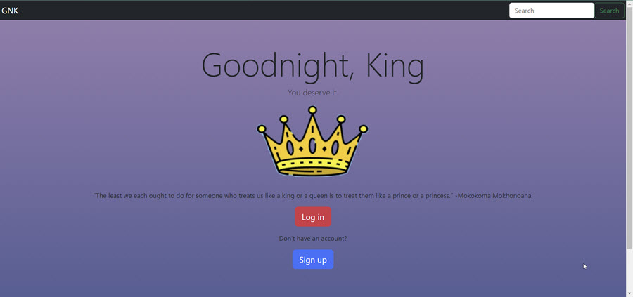
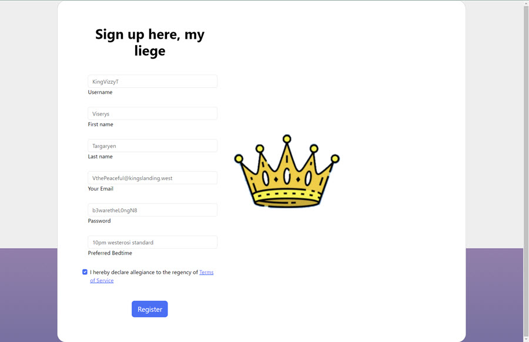
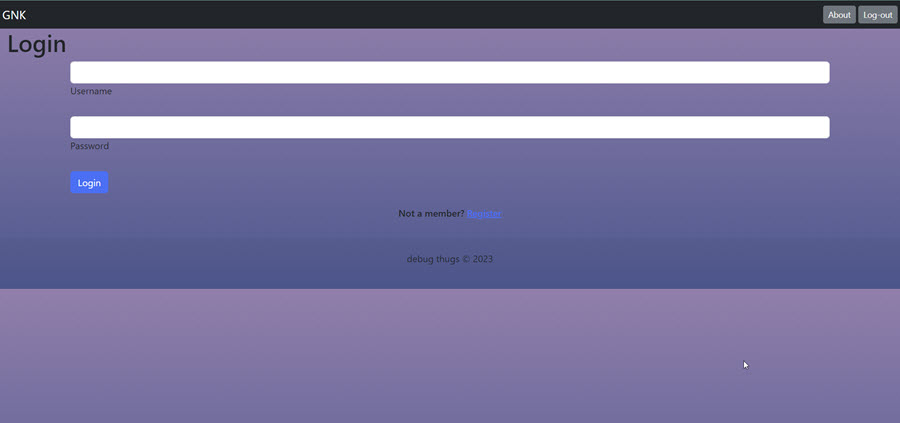
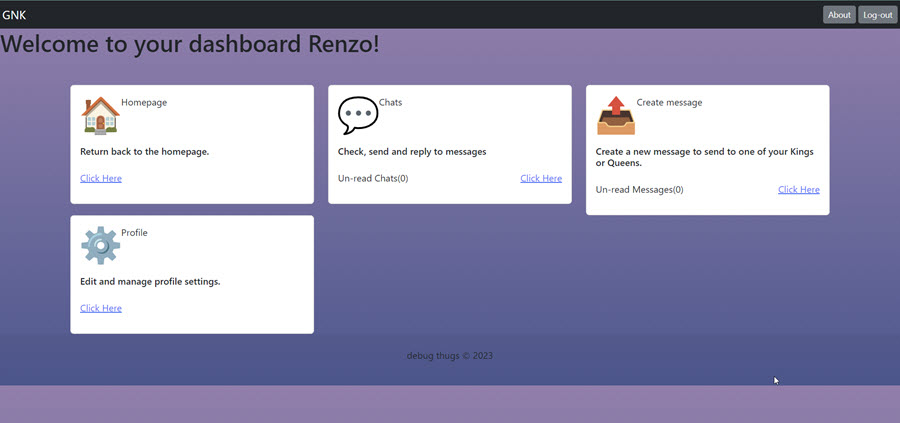
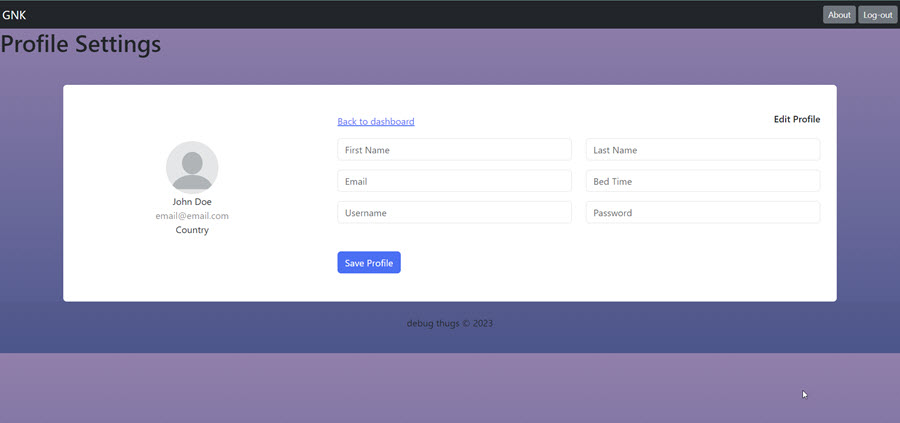

# Goodnight, King!
  

## Description

AS A… friend who's a working professional,  
I WANT… to check in on my friends by sending them online notes & affirmations  
SO THAT… we stave off societal isolation & nihilistic temptation  

## Table of Contents (Optional)

- [Installation](#installation)
- [Usage](#usage)
- [Credits](#credits)
- [License](#license)
- [Features](#features)

## Installation

Here are the steps needed to access the project for development:    

Step 1: 

    $ npm i

Step 2: 

    $ mysql -uroot -p
    Enter password: ********
    Welcome to the MySQL monitor.  Commands end with ; or \g.
    Your MySQL connection id is 8
    Server version: 8.0.33 MySQL Community Server - GPL

    Copyright (c) 2000, 2023, Oracle and/or its affiliates.

    Oracle is a registered trademark of Oracle Corporation and/or its
    affiliates. Other names may be trademarks of their respective
    owners.

    Type 'help;' or '\h' for help. Type '\c' to clear the current input statement.

    mysql> source db/schema.sql

Step 3:

    $ npm run seeds

Step 4: 

    $ npm start

Step 5: 

    Access site: localhost:3000  

## Usage
Landing page:  
  

Sign-up page:  
  

Login page:  
  

Dashboard:  

## Credits

Sequelize documentation: https://sequelize.org/docs/v6/  

**Contributors:**  
Bia Shimizu-Reynolds: https://github.com/luxardOri  
Christina Hoang: https://github.com/christinahoang32  
Jordan Lockhart: https://github.com/liljlock  
Matt Miceli: https://github.com/Matty-Bamboo  
Renzo San Juan: https://github.com/renzosj  

**Tutorials:**  
Google Bard: https://bard.google.com/ (use this a lot for clarification and syntax help)  

**Tutors:**  
Erik Hirsch (tutoring session)  

## License

MIT License

Copyright (c) 2023 Debug Thugs

Permission is hereby granted, free of charge, to any person obtaining a copy
of this software and associated documentation files (the "Software"), to deal
in the Software without restriction, including without limitation the rights
to use, copy, modify, merge, publish, distribute, sublicense, and/or sell
copies of the Software, and to permit persons to whom the Software is
furnished to do so, subject to the following conditions:

The above copyright notice and this permission notice shall be included in all
copies or substantial portions of the Software.

THE SOFTWARE IS PROVIDED "AS IS", WITHOUT WARRANTY OF ANY KIND, EXPRESS OR
IMPLIED, INCLUDING BUT NOT LIMITED TO THE WARRANTIES OF MERCHANTABILITY,
FITNESS FOR A PARTICULAR PURPOSE AND NONINFRINGEMENT. IN NO EVENT SHALL THE
AUTHORS OR COPYRIGHT HOLDERS BE LIABLE FOR ANY CLAIM, DAMAGES OR OTHER
LIABILITY, WHETHER IN AN ACTION OF CONTRACT, TORT OR OTHERWISE, ARISING FROM,
OUT OF OR IN CONNECTION WITH THE SOFTWARE OR THE USE OR OTHER DEALINGS IN THE
SOFTWARE.  

## Features

- Add in a friend list.
- Send message at bedtime.
- In the future we would like to build out the profile page:  

